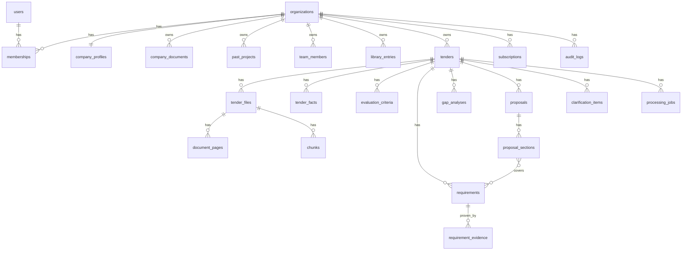

# وثيق | Wathiq — وثيقة التصميم (قبل التنفيذ)

> مساعد ذكي للمنافسات الحكومية السعودية: من كراسة الشروط إلى مصفوفة امتثال موثّقة وعرض فني جاهز.
> **الاسم:** «وثيق» — من الوثوق والتوثيق؛ كل متطلب يعرضه المنتج موثّق باقتباس ورقم صفحة من الكراسة، وهذا هو جوهر المنتج.
> بدائل: «سَنَد | Sanad»، «إتقان | Itqan».

الحالة: **مسودة للاعتماد** — لم يُكتب أي كود بعد.

---

## 1. القرارات المعمارية الرئيسية

| المجال | القرار | السبب |
|---|---|---|
| الإطار | Next.js 16 (App Router) + TypeScript + Tailwind v4 | حسب المتطلبات |
| قاعدة البيانات | PostgreSQL 16 + **Drizzle ORM** (مخطط TypeScript + ترحيلات SQL) | SQL شفاف قابل للنقل لأي مزود؛ لا ارتباط بمزود سحابي |
| عزل البيانات | عمود `org_id` في كل جدول + **Row Level Security** في Postgres عبر متغير جلسة `app.org_id` يُضبط في كل معاملة، + طبقة Repository تفرض المؤسسة | دفاع مزدوج: حتى خطأ برمجي في استعلام لا يسرّب بيانات شركة أخرى |
| المصادقة | **Better Auth** (بريد + كلمة مرور، رابط سحري، 2FA لاحقاً) مخزّنة في نفس Postgres | ذاتية الاستضافة بالكامل، لا خدمة خارجية |
| تخزين الملفات | واجهة **S3-compatible** (MinIO محلياً؛ أي مزود سعودي متوافق مع S3 لاحقاً) | النقل للاستضافة المحلية = تغيير متغيرات بيئة فقط |
| تشفير الملفات | **Envelope encryption**: مفتاح بيانات AES-256-GCM لكل منافسة، مغلّف بمفتاح رئيسي (KMS أو متغير بيئة في MVP) | الحذف النهائي = حذف الملفات + إتلاف مفتاح المنافسة (crypto-shredding) |
| طابور المهام | **pg-boss** (طابور فوق Postgres) + عملية Worker مستقلة | لا حاجة لـ Redis؛ مكوّن بنية أقل عند النقل |
| التقدم الحي | جدول `processing_jobs` (مرحلة + نسبة) + **SSE** endpoint | شريط تقدم دقيق عبر دقائق من المعالجة |
| استخراج PDF النصي | `pdfjs-dist` — نص + إحداثيات كل كلمة لكل صفحة | الإحداثيات ضرورية لتظليل الاقتباس في العارض |
| OCR | **Tesseract 5** (`ara+eng`) داخل حاوية الـ Worker، بعد تحويل الصفحات بـ `pdftoppm` (300dpi)؛ واجهة مجرّدة تسمح بمزود سحابي لاحقاً | مفتوح المصدر، يعمل محلياً داخل السعودية |
| كشف الممسوح | لكل صفحة على حدة: إن كان النص المستخرج < 40 حرفاً ذا معنى → OCR لتلك الصفحة فقط | كراسات مختلطة (نص + مرفقات ممسوحة) شائعة جداً |
| محرك الذكاء | واجهة `LLMProvider` مجرّدة؛ الافتراضي Claude عبر Anthropic API، مع Structured Outputs | قابل للاستبدال بنموذج مستضاف محلياً لاحقاً |
| البرومتات | ملفات Markdown في `prompts/` بترويسة YAML (`id`, `version`, `model`, `schema`)؛ كل تشغيل يُسجَّل برقم الإصدار في `ai_runs` | قابلة للتعديل والإصدارات والمقارنة دون نشر كود |
| التحقق | Zod لكل مخرج + **مطابقة الاقتباسات برمجياً** (انظر §5) | لا يُعرض أي متطلب كمؤكد دون اقتباس مطابق |
| i18n | `next-intl`؛ العربية افتراضية `dir="rtl"`، الإنجليزية ثانوية؛ خط IBM Plex Sans Arabic | عربي أولاً |
| عارض PDF | `react-pdf` (pdf.js) + طبقة تظليل من الإحداثيات المخزّنة | |
| التصدير | `docx` (Word بترويسة الشركة) + `exceljs` (مصفوفة الامتثال) | توليد على الخادم |
| الدفع | **Moyasar** (مدى، Apple Pay، STC Pay، فيزا/ماستر) مع tokenization للتجديد؛ واجهة `PaymentProvider` تسمح بإضافة Tap | Moyasar لا يوفّر اشتراكات مُدارة، لذا دورة الفوترة تُدار من جهتنا بالبطاقة المحفوظة |
| الاختبارات | Vitest (وحدات: المطابقة، التطبيع، المخططات) + Playwright (رحلة المستخدم) | |
| التشغيل المحلي | `docker compose`: postgres, minio, worker (مع tesseract) | |

---

## 2. هيكل المشروع

```
wathiq/
├─ docker-compose.yml            # postgres, minio, app, worker
├─ Dockerfile / Dockerfile.worker # الـ worker يحتوي tesseract-ocr-ara + poppler-utils
├─ drizzle.config.ts
├─ prompts/                      # برومتات مُصدَّرة، قابلة للتعديل دون كود
│  ├─ system.md                  # البرومت النظامي العام (المرفق من العميل)
│  ├─ extract-summary.v1.md
│  ├─ extract-requirements.v1.md
│  ├─ gap-analysis.v1.md
│  ├─ proposal-section.v1.md
│  └─ clarifications.v1.md
├─ messages/ar.json, en.json     # نصوص الواجهة
├─ src/
│  ├─ app/
│  │  ├─ [locale]/
│  │  │  ├─ (auth)/login, register, invite/[token]
│  │  │  ├─ (app)/
│  │  │  │  ├─ dashboard/                      # المنافسات + تنبيهات الانتهاء
│  │  │  │  ├─ tenders/new/                     # الرفع
│  │  │  │  ├─ tenders/[id]/
│  │  │  │  │  ├─ page.tsx                      # الملخص
│  │  │  │  │  ├─ processing/                   # شريط التقدم
│  │  │  │  │  ├─ compliance/                   # مصفوفة الامتثال + عارض PDF
│  │  │  │  │  ├─ documents/                    # قائمة المستندات النظامية
│  │  │  │  │  ├─ gaps/                         # الفجوات وقرار التقديم
│  │  │  │  │  ├─ proposal/                     # محرر العرض الفني
│  │  │  │  │  ├─ clarifications/               # خطاب الاستفسارات
│  │  │  │  │  └─ settings/                     # حذف نهائي، الأعضاء
│  │  │  │  ├─ library/                         # ملف الشركة
│  │  │  │  │  ├─ profile, projects, team, certificates, policies, methodologies
│  │  │  │  ├─ settings/ (organization, members, billing, audit-log)
│  │  │  └─ (marketing)/ page.tsx, pricing
│  │  └─ api/
│  │     ├─ auth/[...all]
│  │     ├─ uploads/ (presign, complete)
│  │     ├─ tenders/[id]/events  (SSE progress)
│  │     ├─ files/[id]  (بث مفكوك التشفير بعد التحقق من الصلاحية)
│  │     ├─ exports/[id]
│  │     └─ billing/moyasar/{checkout,callback,webhook}
│  ├─ server/
│  │  ├─ db/ (schema/*.ts, client.ts, withOrg.ts ← يضبط RLS, migrations/)
│  │  ├─ auth/ (better-auth config, requireRole)
│  │  ├─ storage/ (s3.ts, crypto.ts ← envelope encryption)
│  │  ├─ queue/ (boss.ts, jobs.ts)
│  │  ├─ pipeline/
│  │  │  ├─ ingest.ts        # تحديد نوع كل صفحة
│  │  │  ├─ pdf-text.ts      # pdf.js: نص + إحداثيات
│  │  │  ├─ ocr.ts           # tesseract
│  │  │  ├─ chunk.ts         # مقاطع بحدود البنود مع رقم الصفحة
│  │  │  ├─ analyze.ts       # استدعاءات النموذج على دفعات
│  │  │  └─ verify.ts        # مطابقة الاقتباسات
│  │  ├─ ai/ (provider.ts, anthropic.ts, prompts.ts ← loader+versions, schemas/*.ts ← Zod)
│  │  ├─ text/ (arabic-normalize.ts, fuzzy.ts)
│  │  ├─ services/ (tenders, requirements, library, gaps, proposals, exports, billing, audit)
│  │  └─ billing/ (moyasar.ts, plans.ts, entitlements.ts)
│  ├─ worker/index.ts        # نقطة دخول عملية المعالجة
│  ├─ components/ (ui/, pdf-viewer/, compliance-table/, editor/, progress/)
│  └─ lib/ (utils, formatters: هجري/ميلادي، ريال)
└─ tests/ (unit/, e2e/, fixtures/ ← كراسات تجريبية)
```

---

## 3. مخطط قاعدة البيانات

> كل جدول أعمال يحمل `org_id` مع سياسة RLS: `org_id = current_setting('app.org_id')::uuid`.
> المعرفات `uuid` (v7)، والتواريخ `timestamptz`، والمبالغ بالهللة `bigint`.



### 3.1 الحسابات والمؤسسات

| الجدول | الأعمدة الرئيسية |
|---|---|
| `organizations` | id, name_ar, name_en, cr_number, logo_file_id, letterhead_file_id, plan_code, data_key_wrapped, created_at |
| `users` | id, email (unique), name, locale, email_verified, created_at *(+ جداول Better Auth: sessions, accounts, verifications)* |
| `memberships` | org_id, user_id, role **enum(owner, editor, reviewer)**, status, PK(org_id,user_id) |
| `invitations` | id, org_id, email, role, token_hash, expires_at, accepted_at, invited_by |

**الأدوار:** المالك (كل شيء + الفوترة + الحذف النهائي + الأعضاء) · المحرر (رفع، تعديل المصفوفة والعرض والمكتبة) · المراجع (قراءة، تعليق، اعتماد/رفض الأقسام والمتطلبات).

### 3.2 ملف الشركة (مكتبة المحتوى)

| الجدول | الأعمدة الرئيسية |
|---|---|
| `company_profiles` | org_id (PK), about_ar, about_en, vision, founded_year, employees_count, cities[], activities[], contact jsonb |
| `company_documents` | id, org_id, doc_type **enum**(cr, zakat, gosi, nitaqat, chamber, classification, local_content, saudization, iso_9001, iso_45001, iso_14001, vat, municipal_license, bank_letter, other), number, issuer, issue_date, **expiry_date**, file_id, notes |
| `past_projects` | id, org_id, title, client_entity, value_halalas, start_date, end_date, duration_months, scope, sector, tags[], completion_cert_file_id |
| `team_members` | id, org_id, full_name, title, years_experience, education, certifications[], skills[], cv_text, cv_file_id, nationality_saudi bool |
| `library_entries` | id, org_id, kind **enum**(policy_quality, policy_safety, policy_environment, methodology, org_structure, other), title, body (markdown), version, updated_by |
| `expiry_alerts` | id, org_id, company_document_id, alert_at, kind(60d,30d,7d,expired), sent_at |

### 3.3 الملفات والمعالجة

| الجدول | الأعمدة الرئيسية |
|---|---|
| `files` | id, org_id, storage_key, original_name, mime, size_bytes, sha256, **encryption_iv**, key_scope(org\|tender), tender_id?, uploaded_by, created_at |
| `tenders` | id, org_id, title, agency, reference_number, tender_type, status **enum**(uploading, processing, ready, failed, archived), decision **enum**(pending, go, no_go), readiness_score, **data_key_wrapped**, created_by, created_at |
| `tender_files` | id, tender_id, org_id, file_id, role **enum**(booklet, annex, boq, other), page_count, ocr_pages_count, extraction_status |
| `document_pages` | id, tender_file_id, org_id, page_no, source **enum**(text, ocr), text, text_norm (للمطابقة), ocr_confidence, width, height, **words jsonb** (نص + bbox لكل كلمة) — UNIQUE(tender_file_id, page_no) |
| `chunks` | id, tender_file_id, org_id, ordinal, page_start, page_end, section_ref (مثل «4.2.1»), heading, text, token_count |
| `processing_jobs` | id, tender_id, org_id, kind(extract, analyze, gaps, proposal, clarifications, export), status, **stage**, **progress 0–100**, message, error, started_at, finished_at |
| `ai_runs` | id, org_id, tender_id, task, prompt_id, **prompt_version**, model, input_tokens, output_tokens, latency_ms, raw_output jsonb, validation_errors jsonb, status |

### 3.4 الملخص ومصفوفة الامتثال

| الجدول | الأعمدة الرئيسية |
|---|---|
| `tender_facts` | id, tender_id, org_id, **key enum**(agency, reference_number, tender_type, booklet_price, initial_guarantee, final_guarantee, execution_duration, inquiry_deadline, submission_deadline, envelope_opening, site_visit, …), value_text, value_date, value_amount, **citation** (file_id, page_no, quote, bbox), **verification enum**(verified, fuzzy, unverified), edited_by |
| `evaluation_criteria` | id, tender_id, org_id, parent_id, kind(technical, financial), name, weight_pct, min_score, description, citation…, verification |
| `requirements` | id, tender_id, org_id, code («REQ-012»), **category enum**(regulatory, administrative, technical, financial, local_content, quality_safety), text, section_ref, tender_file_id, page_no, **quote**, quote_bbox jsonb, **obligation enum**(mandatory, preferred), **disqualifying bool**, evidence_required, required_doc_type (→ doc_type), **status enum**(available, missing, needs_review), **verification enum**(verified, fuzzy, unverified), confidence, assignee_id, due_date, reviewer_decision, notes, source(ai, manual) |
| `requirement_evidence` | id, requirement_id, org_id, evidence_type(company_document, past_project, team_member, library_entry, file), evidence_id, match_source(auto, manual), note |
| `requirement_comments` | id, requirement_id, org_id, user_id, body, created_at |

> **قائمة المستندات النظامية** ليست جدولاً مستقلاً: هي `requirements` بفئة `regulatory` ولها `required_doc_type`، مربوطة تلقائياً بـ `company_documents` المطابقة، وتُحسب حالتها (سارية / تنتهي قبل موعد التقديم / منتهية / غير موجودة).

### 3.5 الفجوات والعرض الفني والاستفسارات

| الجدول | الأعمدة الرئيسية |
|---|---|
| `gap_analyses` | id, tender_id, org_id, readiness_score, mandatory_coverage, critical_gaps jsonb, recommendation(go, conditional, no_go), rationale, ai_run_id, created_at |
| `proposals` | id, tender_id, org_id, version, status(draft, in_review, approved), approved_by, approved_at |
| `proposal_sections` | id, proposal_id, org_id, ordinal, title, criterion_id?, content (ProseMirror JSON), **placeholders_count**, generated_by_run_id, is_edited, review_status(pending, approved, changes_requested) |
| `section_requirements` | section_id, requirement_id, covered bool — PK(section_id, requirement_id) |
| `clarification_items` | id, tender_id, org_id, issue_type(ambiguous, conflicting, missing_info), question, citations jsonb (1..n اقتباس), included bool, ordinal |
| `exports` | id, tender_id, org_id, kind(proposal_docx, compliance_xlsx, clarifications_docx), file_id, created_by, created_at |

### 3.6 الاشتراكات والتدقيق

| الجدول | الأعمدة الرئيسية |
|---|---|
| `plans` | code(per_tender, monthly, annual_enterprise), price_halalas, interval, limits jsonb (منافسات/شهر، مستخدمين، صفحات) |
| `subscriptions` | id, org_id, plan_code, status(trialing, active, past_due, canceled), current_period_start/end, provider, provider_token_id, cancel_at_period_end |
| `payments` | id, org_id, subscription_id?, tender_credit_id?, amount_halalas, method(mada, applepay, creditcard, stcpay), provider_payment_id, status, raw jsonb |
| `tender_credits` | id, org_id, source_payment_id, consumed_by_tender_id, consumed_at |
| `usage_counters` | org_id, period, tenders_count, pages_processed, ai_tokens |
| `audit_logs` | id, org_id, actor_user_id, action(upload, view_file, edit_requirement, export, delete_tender, role_change, …), entity_type, entity_id, ip, user_agent, metadata jsonb, created_at — **إلحاق فقط** (لا UPDATE/DELETE عبر RLS) |

---

## 4. خط المعالجة (Worker)

```
رفع (presigned + تشفير) ─▶ extract ─▶ analyze ─▶ verify ─▶ ready
```

| المرحلة | التقدم | الإجراء |
|---|---|---|
| 1. التحضير | 0–5% | فك التشفير في الذاكرة، عدّ الصفحات |
| 2. الاستخراج | 5–40% | لكل صفحة: pdf.js؛ إن كانت فارغة ← OCR. حفظ `document_pages` مع إحداثيات الكلمات |
| 3. التقطيع | 40–45% | كشف ترقيم البنود (1. / 1.1 / أولاً / المادة …) وتقسيم ≈1.5k توكن مع رقم الصفحة |
| 4. الملخص | 45–55% | برومت `extract-summary` على أول الصفحات + الأقسام ذات الصلة |
| 5. المتطلبات | 55–90% | برومت `extract-requirements` على دفعات متوازية من المقاطع؛ دمج المكررات |
| 6. التحقق | 90–100% | مطابقة كل اقتباس (§5)، ربط تلقائي بالمستندات النظامية |

كل مرحلة idempotent وقابلة لإعادة المحاولة، والتقدم يُكتب في `processing_jobs` ويُبث عبر SSE.

---

## 5. التحقق من الاقتباسات (إلزامي)

1. **تطبيع عربي** لكلا النصين: إزالة التشكيل والتطويل، توحيد (أ إ آ ← ا)، (ى ← ي)، (ة ← ه)، الأرقام الهندية ← لاتينية، توحيد المسافات وعلامات الترقيم.
2. **مطابقة تامة** في نص الصفحة المذكورة (مع السماح بامتداد الاقتباس للصفحة التالية) ← `verified`.
3. **مطابقة تقريبية** (نافذة منزلقة بتشابه على مستوى الكلمات ≥ 0.9 — ضروري لأخطاء OCR) ← `fuzzy` ويُعرض بشارة «يحتاج مراجعة».
4. إن لم يوجد ← `unverified`: **لا يظهر في المصفوفة كمتطلب مؤكد**، بل في تبويب منفصل «غير موثّق» ليقرر المستخدم.
5. عند المطابقة تُحسب `quote_bbox` من إحداثيات الكلمات لتظليل الموضع في العارض.

---

## 6. خطة المراحل

| # | المرحلة | المخرَج القابل للاختبار |
|---|---|---|
| 1 | الرفع والاستخراج | رفع كراسة + ملاحق ← شريط تقدم ← عارض صفحات يبين مصدر كل صفحة (نص/OCR) والمقاطع |
| 2 | الملخص ومصفوفة الامتثال | بطاقة الملخص، مصفوفة بفلاتر، النقر يفتح PDF مع تظليل، تبويب «غير موثّق» |
| 3 | ملف الشركة والفجوات | مكتبة كاملة، تنبيهات انتهاء، قائمة المستندات النظامية، نسبة الجاهزية والنواقص الحرجة |
| 4 | العرض الفني والتصدير | محرر أقسام + إعادة توليد، إبراز غير المغطى والحقول الناقصة، خطاب استفسارات، تصدير docx/xlsx |
| 5 | الحسابات والاشتراكات | دعوات وأدوار ومراجعة واعتماد، باقات Moyasar، سجل التدقيق، الحذف النهائي |

> ملاحظة: في المراحل 1–4 سيكون هناك مستخدم ومؤسسة افتراضيان (seed) مع بنية `org_id` + RLS كاملة من اليوم الأول، ثم تُفعَّل واجهات الحسابات في المرحلة 5.
